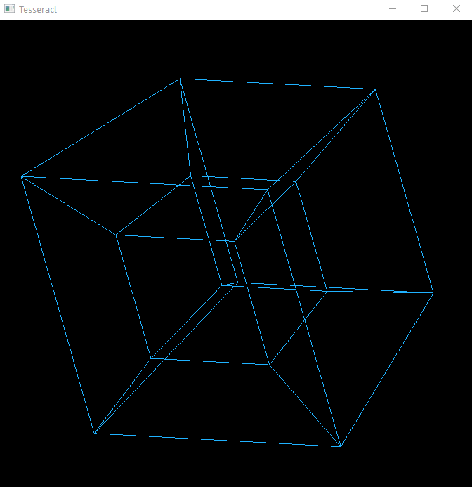

# Tesseract

This is my second attempt at a tesseract problem. My first attempt I used 3D points because I lacked the fundemental understanding of what a hypercube was. After research, I have taken my work from my previous attempt and successfully finished this rendering application. the [The freeGLUT library](http://freeglut.sourceforge.net/) was used.

controls:

wasdqe - camera controls

01234 - speed controls

'-' - decrease distance between cubes

'+' - increase distance between cubes

'=' - set distance back to default (max)

ESC - exit
